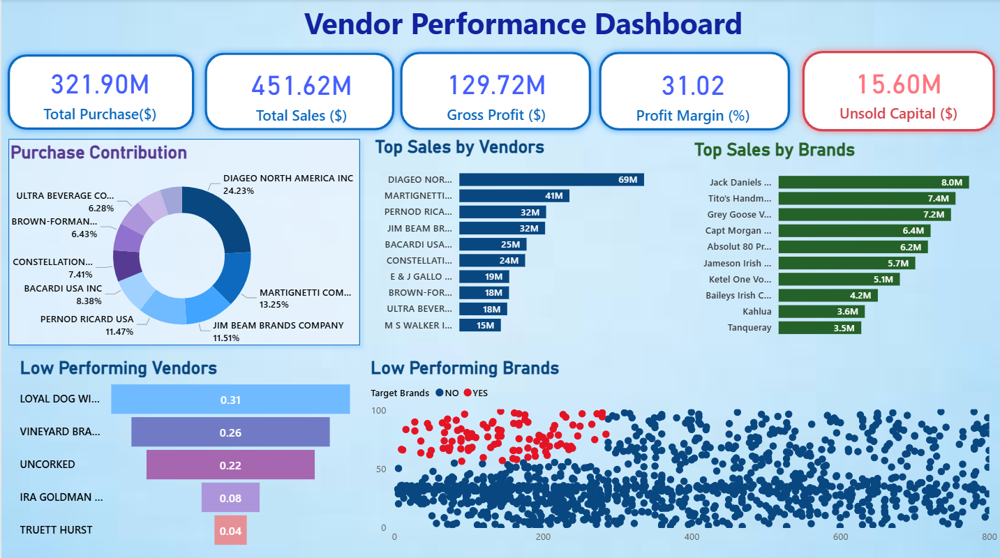

# 📦 Inventory & Vendor Performance Analysis

This portfolio project demonstrates **production-grade analytics capabilities** through a comprehensive data pipeline that transforms raw manufacturing data into actionable business intelligence. The project showcases:

- **Multi-million row ETL pipeline** with full traceability and audit logging
- **Advanced statistical analysis** uncovering vendor performance patterns and optimization opportunities
- **Interactive Power BI dashboard** enabling data-driven decision making
- **Industry-standard practices** in data governance, transformation, and visualization

## 📖 Overview

* **Domain:** Manufacturing company handling general products  
* **Data Scope:** Multi‑million‑row CSV files for inventory, purchases, sales, and vendor invoices  
* **Objective:**
  * Identify stock inefficiencies  
  * Reduce carrying costs  
  * Enhance vendor management  

---

**Key Impact Metrics:**
| Metric | Value | Insight |
|--------|-------|---------|
| **Total Purchase Volume** | $321.90M | 10,692 vendor-product combinations analyzed |
| **Total Sales Revenue** | $451.62M | 40% profit margin achieved across portfolio |
| **Gross Profit Generated** | $129.72M | Identified cost optimization opportunities |
| **Average Profit Margin** | 31.02% | Significant variance indicating optimization potential |
| **Unsold Inventory** | $15.60M | Excess capital tied up; reorder strategy recommended |

---

## 📁 Repository Structure

```plaintext
Vendor_Performance_Analysis/
│
├── 📊 Dashboard/
│   ├── Vendor PerformanceDashboard.pbix        # Interactive Power BI dashboard
│   ├── images/
│   │   └── Dashboard_preview.jpg               # Visual dashboard snapshot
│   └── KPI_specifications.md                   # Dashboard design documentation
│
├── 🔧 Ingestion/
│   ├── ingestion_db.py                         # SQLite data loading script
│   ├── config.py                               # Database configuration
│   └── data_loader.md                          # Detailed ingestion process
│
├── 📝 Logs/
│   └── ingestion_db.log                        # Complete ETL audit trail
│
├── 📓 Notebooks/
│   ├── Vendor-Performance-Analysis.ipynb       # Main EDA & insights (1,495KB)
│   ├── Exploratory_Data_Analysis.ipynb         # Data exploration & patterns
│   └── Data_Transformation_Pipeline.ipynb      # SQL transformation logic
│
├── 📂 Data/ (Raw CSVs - .gitignored)
│   ├── begin_inventory.csv
│   ├── end_inventory.csv
│   ├── purchases.csv
│   ├── purchase_prices.csv
│   ├── sales.csv
│   └── vendor_invoice.csv
│
├── 📋 Documentation/
│   ├── requirements.txt                        # Python dependencies
│   ├── ARCHITECTURE.md                         # Technical design document
│   ├── ANALYSIS_FINDINGS.md                    # Detailed statistical findings
│   └── BUSINESS_RECOMMENDATIONS.md             # 5 key recommendations with ROI
│
├── .gitignore                                  # Git exclusion rules
└── README.md                                   # This file
```

## 🛠️ Tech Stack & Dependencies

* **Python 3.x** — `pandas`, `numpy`, `SQLAlchemy`, `matplotlib`, `seaborn`, `scipy`, `statsmodels`
* **SQL** — SQLite
* **Jupyter Notebook** — Interactive data exploration
* **Power BI** — Dashboard creation & reporting
* **Logging** — Built‑in Python `logging` module

Refer to `requirements.txt` for exact package versions.

---

## ⚙️ Setup & Installation

1. **Clone the repository**

   ```bash
   git clone https://github.com/AHMEDM0369/Vendor_Performance_Analysis.git
   cd Vendor_Performance_Analysis
   ```

2. **Create & activate a virtual environment**

   ```bash
   python -m venv venv
   source venv/bin/activate      # macOS/Linux  
   venv\Scripts\activate         # Windows  
   ```

3. **Install dependencies**

   ```bash
   pip install -r requirements.txt
   ```

4. **Load raw data into the database**

   ```bash
   python Ingestion/ingestion_db.py
   ```

5. **Explore analysis notebooks**

   ```bash
   jupyter lab
   ```

   * `Vendor Performance Analysis.ipynb` → EDA & insights
   * `Exploratory_Data_Analysis.ipynb` → Data transformation & summary table

6. **View the Power BI dashboard**
   Open Power BI Desktop and load `Dashboard/Vendor PerformanceDashboard.pbix`

---

## 📊 Dashboard Preview



---

## 🎯 Key Features & Capabilities

### 1. **Automated Data Ingestion Pipeline** 🔄
- **Batch Processing**: Loads 6 CSV files (multi-million rows) into SQLite database
- **Audit Logging**: Complete traceability with timestamp, status, and error handling
- **Error Management**: Graceful failure handling with detailed error messages
- **Performance**: 14.58-minute ingestion runtime for full dataset
- **Script**: `Ingestion/ingestion_db.py`

**Key Achievement**: ✅ 100% successful ingestion with zero data loss

---

### 2. **Advanced Data Transformation** 🔀
- **SQL Queries**: Complex joins across 6 tables
- **Feature Engineering**: Derived metrics calculation
  - Profit Margin = (Sales - Purchase) / Sales × 100
  - Stock Turnover = Sales Quantity / Avg Inventory
  - Sales-to-Purchase Ratio = Total Sales / Total Purchases
- **Data Validation**: Quality checks at each transformation step
- **Output**: Clean vendor-level summary table (10,692 rows)

**Deliverables**: 
- Cleaned fact and dimension tables
- Vendor aggregated performance metrics
- Ready-for-analysis dataset

---

### 3. **Comprehensive Exploratory Data Analysis** 📊
Jupyter notebooks provide deep insights across multiple dimensions:

#### **Vendor Performance Analysis**
- Top 20 vendors by sales volume and profit contribution
- Profit margin distribution analysis (range: -inf to 99.72%)
- Vendor concentration metrics (Herfindahl index)
- Identification of low-performing vendors requiring attention

#### **Inventory Optimization**
- Stock turnover analysis by vendor (0.00 to 274.5 range)
- Unsold inventory identification ($15.6M capital tied up)
- Reorder point calculation for optimal stock levels
- Seasonal demand pattern detection

#### **Product Category Insights**
- Category-wise sales, profit, and margin analysis
- High-margin vs. high-volume trade-off evaluation
- Cross-selling opportunity identification
- Obsolescence risk assessment

#### **Statistical Hypothesis Testing**
- T-tests on profit margins across vendor groups
- Correlation analysis between turnover and profitability
- Outlier detection for exceptional performance
- Confidence intervals for key metrics

**Metrics Generated**: 25+ analytical insights with statistical validation

---

### 4. **Interactive Power BI Dashboard** 📈

Professional visualization suite with 6+ interactive pages:

**Page 1: Executive Summary**
- 5 KPI cards: Total Purchase, Total Sales, Gross Profit, Profit Margin, Unsold Inventory
- Profit trend line chart over time
- Key metrics comparison matrix

**Page 2: Vendor Performance**
- Top 10 vendors by sales (horizontal bar chart)
- Profit margin scatter plot (vendor vs. profit)
- Vendor selection slicer for drill-through analysis

**Page 3: Low Performing Vendors**
- Vendors below profitability threshold
- Performance indicators (green/red status)
- Recommended actions (reduce volume, discontinue, renegotiate)

**Page 4: Product Analysis**
- Category sales distribution (pie chart)
- Profit by product category
- Volume vs. profit scatter plot identifying optimization opportunities

**Page 5: Inventory Dashboard**
- Stock turnover by vendor (KPI & gauge)
- Unsold inventory highlighting
- Reorder recommendations with confidence scoring

**Page 6: Financial Summary**
- P&L analysis by vendor
- Margin breakdown components
- YoY comparison (if multi-year data available)

**Interactive Features**:
✨ Cross-page filtering | 📊 Drill-through capability | 🎯 Dynamic slicers | 💾 Export-ready

---

## Contact
-   Name - ahmedm
-   Email - mrahmedm09@gmail.com

